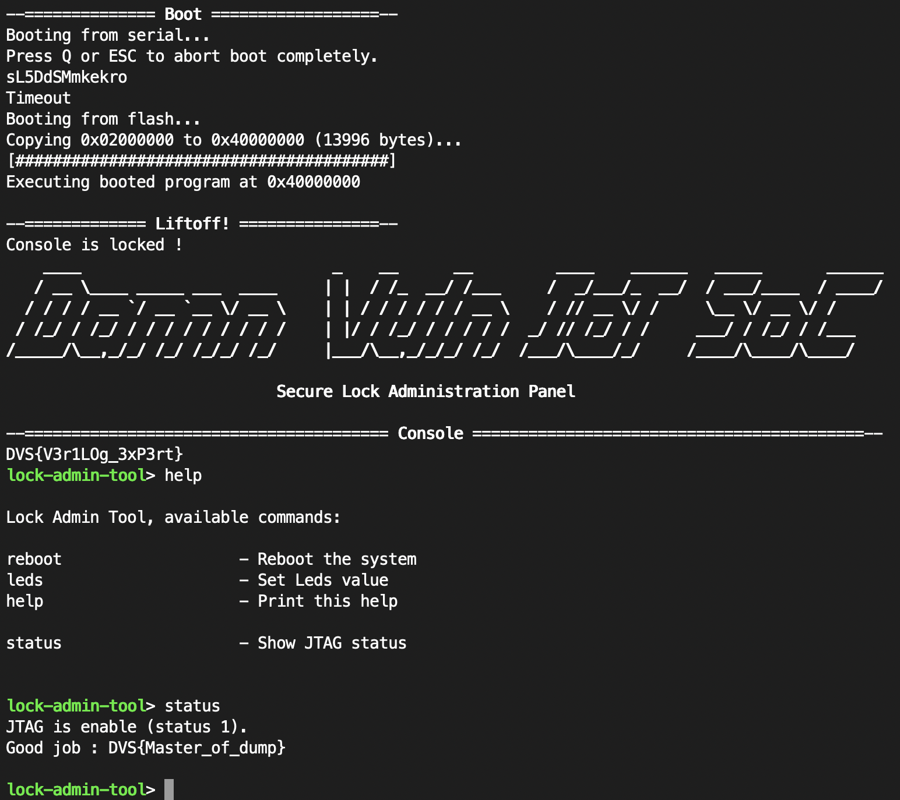

Challenge 5 : Enable JTAG (Firmware version)
============================================

.. note:: 

    This challenge can be disable, to change the configuration edit the file ``config.ini`` and modify the field ``jtag_lock_firmware``. This challenge is part of the challenges that revolves around the JTAG, this implies that if other challenges are activated it will change the Migen code used as well as the Verilog code generated, however the principle of the challenge remains the same. For more details I invite you to look at the : ``Damn-Vuln-IoT-SoC/litex/litex/soc/cores/jtag_lock.py``.

.. warning::

    This challenge requires more installation than the previous ones since we use an external SPI flash memory to store the firmware and boot on it. It is therefore necessary to have a SPI programmer.

Introduction
------------

This challenge concerns the JTAG debugging port, at the startup of the FPGA board the JTAG port is disabled, to know the status of the JTAG port a command is available in the administration panel. The ``status`` command allows to display if the JTAG port is enabled or not and if it is blocked by a password or unblocked (this is only displayed if a JTAG port locking challenge has been activated). The hardware description error here is that the JTAG interface enable status is not connected to the reset logic. To exploit this vulnerability we will modify the contents of the external SPI flash memory to execute the JTAG activation and then reset the original firmware. Since the JTAG interface is not connected to the reset logic we reboot while keeping the state of the JTAG interface. We use this technique to respect the CTF rules. This challenge is considered to have a high difficulty.

Analysis of the Board Support Package headers
---------------------------------------------

In this part, we will quickly analyze the header file csr.h, this header file writes all the necessary functions to write to the CSR from the firmware. It is an essential file for the development of application for our SoC. We can see that there is a function to activate the JTAG and a second one to control the LEDs. These functions give us the addresses where the 2 CSRs are mapped :

* ``0xF0002000`` is the adress where the CSR which control the JTAG interface is memory mapped.
* ``0xF0003000`` is the adress where the CSR which control the LEDs is memory mapped.

We can therefore try to write a shellcode that we will put on the flash memory to activate the JTAG and activate the first LED to show that the shellcode has been executed.

.. code-block:: c

    ...

    /* jtag */
    #define CSR_JTAG_BASE (CSR_BASE + 0x2000L)
    #define CSR_JTAG_JTAG_LOCK_ADDR (CSR_BASE + 0x2000L)
    #define CSR_JTAG_JTAG_LOCK_SIZE 1
    static inline uint32_t jtag_jtag_lock_read(void) {
        return csr_read_simple((CSR_BASE + 0x2000L));
    }
    static inline void jtag_jtag_lock_write(uint32_t v) { // Write 1 to enable JTAG
        csr_write_simple(v, (CSR_BASE + 0x2000L));
    }
    #define CSR_JTAG_JTAG_STATUS_ADDR (CSR_BASE + 0x2004L)
    #define CSR_JTAG_JTAG_STATUS_SIZE 1
    static inline uint32_t jtag_jtag_status_read(void) {
        return csr_read_simple((CSR_BASE + 0x2004L));
    }

    ...

    /* leds */
    #define CSR_LEDS_BASE (CSR_BASE + 0x3000L)
    #define CSR_LEDS_OUT_ADDR (CSR_BASE + 0x3000L)
    #define CSR_LEDS_OUT_SIZE 1
    static inline uint32_t leds_out_read(void) {
        return csr_read_simple((CSR_BASE + 0x3000L));
    }
    static inline void leds_out_write(uint32_t v) { // Write 1 to set LED 1 to on
        csr_write_simple(v, (CSR_BASE + 0x3000L));
    }

    ...

Writing the shellcode
---------------------

The shellcode is very short we just have to write 1 to the 2 addresses we found before, using 32 bit RiscV instrcutions and in little endian.

Here is the shellcode is used to exploit the bug. The next step to use it is to convert it into ``.fbi`` file using LiteX `utilities <https://github.com/enjoy-digital/litex/wiki/Load-Application-Code-To-CPU#spiflash-boot>`_.

.. code-block:: 

        00000000 93 07 10 00     li         a5,0x1
        00000004 37 27 00 f0     lui        a4,0xf0002
        00000008 23 20 f7 00     sw         a5,0x0(a4=>DAT_f0002000)
        0000000C 37 37 00 f0     lui        a4,0xf0003
        00000010 23 20 f7 00     sw         a5,0x0(a4=>DAT_f0003000)

Resolve the challenge
---------------------

When starting the FPGA board we can see that the firmware is recovered from the external flash memory and that the JTAG interface is not activated.

.. image:: images/firmware_disable.png
  :width: 750
  :alt: The JTAG interface is disable

The we execute the shellcode put in the external memory, and the first LED turn on.

.. image:: images/firmware_shellcode.png
  :width: 750
  :alt: Execute shellcode

Finally we put the original firmware back in the external memory and reset the board, and the JTAG interface is now enable.

