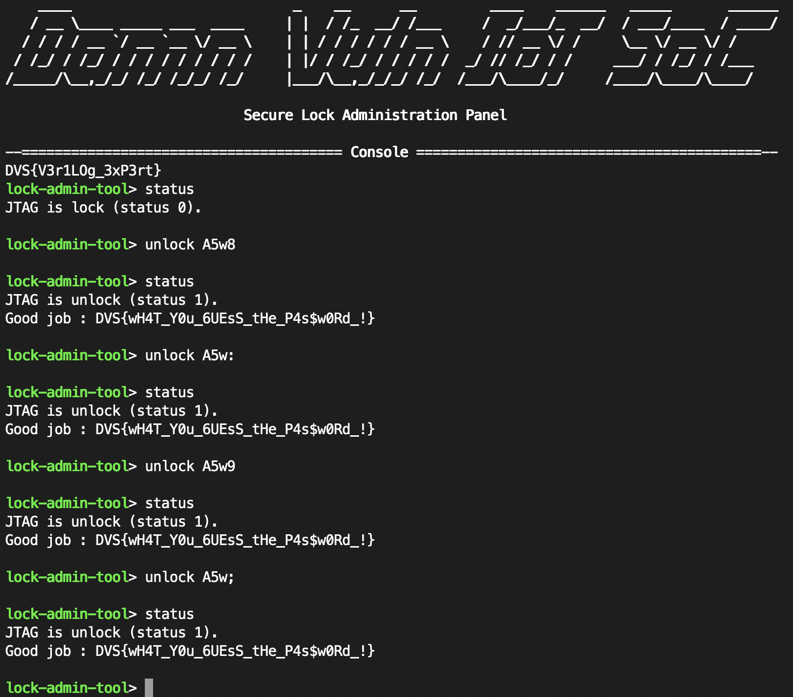

Challenge 3 : Unlock JTAG (Hardcoded version)
=============================================

.. note:: 

    This challenge can be disable, to change the configuration edit the file ``config.ini`` and modify the fields ``jtag_password`` and ``jtag_password_key`` (this is a 4 ASCII character). This challenge is part of the challenges that revolves around the JTAG, this implies that if other challenges are activated it will change the Migen code used as well as the Verilog code generated, however the principle of the challenge remains the same. For more details I invite you to look at the : ``Damn-Vuln-IoT-SoC/litex/litex/soc/cores/jtag_lock.py``.

.. warning::

    You have to know that this challenge is automaticly desactivate if the challenge ``jtag_password_random`` is enable.

Introduction
------------

This challenge is part of the challenges around the JTAG interface, the goal of this challenge is to unlock the JTAG interface protected by a password. Here the password is hardcoded in the Verilog code and is checked bit by bit in the hardware. A bug is present at the level of the verification of the password, since the password is composed of 4 ASCII characters, this one has thus a length of 32 bits, however the hardware verifies only 30 bits on the 32 of the password. To be able to check the status of the JTAG interface you can use the ``status command``, to be able to enter a password you must use the ``unlock`` command. This challenge is rated of medium difficulty, the reading of the bits in the Verilog code has been voluntarily facilitated.

Migen code of the challenge
---------------------------

We can see that the for loop goes from bit 0 to bit 30, each character is recovered from the password assigned in the configuration file.

.. code-block:: python

    ...

    self.comb += [self.password_status.status.eq(1)]
                for i in range(30):
                    self.comb += [
                        If(self.jtag_password_csr.storage[31-i] == int(list(bin(self.encoded_password)[2:].zfill(32))[i], 2),
                            soc.current_cpu.cpu_params["i_jtag_tdi"].eq(pin_tdi),
                            soc.current_cpu.cpu_params["i_jtag_tms"].eq(pin_tms),
                            soc.current_cpu.cpu_params["i_jtag_tck"].eq(pin_tck),
                            pin_tdo.eq(soc.current_cpu.cpu_params["o_jtag_tdo"]),
                        ).Else(
                            dummy_tdi.eq(pin_tdi),
                            dummy_tms.eq(pin_tms),
                            dummy_tck.eq(pin_tck),
                            pin_tdo.eq(0),
                            self.password_status.status.eq(0)
                        )
                    ]

    ...

Verilog code of the challenge
-----------------------------

Now we can recover password by recovering each bit that are checked, here we find the password ``01000001 00110101 01110111 001110??`` which corresponds to the password ``A5w?`` Since only 30 bits are checked several passwords are valid, here are the combinations :

* ``01000001 00110101 01110111 00111000`` is ``A5w8``

* ``01000001 00110101 01110111 00111010`` is ``A5w:``

* ``01000001 00110101 01110111 00111001`` is ``A5w9``

* ``01000001 00110101 01110111 00111011`` is ``A5w;``

The password we put in the configuration file was ``A5w9``.

.. code-block:: verilog

    ...

    always @(*) begin
	main_dummy_tdi <= 1'd0;
	main_basesoc_i_jtag_tdi <= 1'd0;
	main_basesoc_i_jtag_tms <= 1'd0;
	main_dummy_tms <= 1'd0;
	main_basesoc_i_jtag_tck <= 1'd0;
	main_dummy_tck <= 1'd0;
	jtag_tdo <= 1'd0;
	main_password_status_status <= 1'd0;
	main_password_status_status <= 1'd1;
	if ((main_jtag_password_csr_storage[31] == 1'd0)) begin
		main_basesoc_i_jtag_tdi <= jtag_tdi;
		main_basesoc_i_jtag_tms <= jtag_tms;
		main_basesoc_i_jtag_tck <= jtag_tck;
		jtag_tdo <= main_basesoc_o_jtag_tdo;
	end else begin
		main_dummy_tdi <= jtag_tdi;
		main_dummy_tms <= jtag_tms;
		main_dummy_tck <= jtag_tck;
		jtag_tdo <= 1'd0;
		main_password_status_status <= 1'd0;
	end
	if ((main_jtag_password_csr_storage[30] == 1'd1)) begin
		main_basesoc_i_jtag_tdi <= jtag_tdi;
		main_basesoc_i_jtag_tms <= jtag_tms;
		main_basesoc_i_jtag_tck <= jtag_tck;
		jtag_tdo <= main_basesoc_o_jtag_tdo;
	end else begin
		main_dummy_tdi <= jtag_tdi;
		main_dummy_tms <= jtag_tms;
		main_dummy_tck <= jtag_tck;
		jtag_tdo <= 1'd0;
		main_password_status_status <= 1'd0;
	end
	if ((main_jtag_password_csr_storage[29] == 1'd0)) begin
		main_basesoc_i_jtag_tdi <= jtag_tdi;
		main_basesoc_i_jtag_tms <= jtag_tms;
		main_basesoc_i_jtag_tck <= jtag_tck;
		jtag_tdo <= main_basesoc_o_jtag_tdo;
	end else begin
		main_dummy_tdi <= jtag_tdi;
		main_dummy_tms <= jtag_tms;
		main_dummy_tck <= jtag_tck;
		jtag_tdo <= 1'd0;
		main_password_status_status <= 1'd0;
	end
	if ((main_jtag_password_csr_storage[28] == 1'd0)) begin
		main_basesoc_i_jtag_tdi <= jtag_tdi;
		main_basesoc_i_jtag_tms <= jtag_tms;
		main_basesoc_i_jtag_tck <= jtag_tck;
		jtag_tdo <= main_basesoc_o_jtag_tdo;
	end else begin
		main_dummy_tdi <= jtag_tdi;
		main_dummy_tms <= jtag_tms;
		main_dummy_tck <= jtag_tck;
		jtag_tdo <= 1'd0;
		main_password_status_status <= 1'd0;
	end
	if ((main_jtag_password_csr_storage[27] == 1'd0)) begin
		main_basesoc_i_jtag_tdi <= jtag_tdi;
		main_basesoc_i_jtag_tms <= jtag_tms;
		main_basesoc_i_jtag_tck <= jtag_tck;
		jtag_tdo <= main_basesoc_o_jtag_tdo;
	end else begin
		main_dummy_tdi <= jtag_tdi;
		main_dummy_tms <= jtag_tms;
		main_dummy_tck <= jtag_tck;
		jtag_tdo <= 1'd0;
		main_password_status_status <= 1'd0;
	end
	if ((main_jtag_password_csr_storage[26] == 1'd0)) begin
		main_basesoc_i_jtag_tdi <= jtag_tdi;
		main_basesoc_i_jtag_tms <= jtag_tms;
		main_basesoc_i_jtag_tck <= jtag_tck;
		jtag_tdo <= main_basesoc_o_jtag_tdo;
	end else begin
		main_dummy_tdi <= jtag_tdi;
		main_dummy_tms <= jtag_tms;
		main_dummy_tck <= jtag_tck;
		jtag_tdo <= 1'd0;
		main_password_status_status <= 1'd0;
	end
	if ((main_jtag_password_csr_storage[25] == 1'd0)) begin
		main_basesoc_i_jtag_tdi <= jtag_tdi;
		main_basesoc_i_jtag_tms <= jtag_tms;
		main_basesoc_i_jtag_tck <= jtag_tck;
		jtag_tdo <= main_basesoc_o_jtag_tdo;
	end else begin
		main_dummy_tdi <= jtag_tdi;
		main_dummy_tms <= jtag_tms;
		main_dummy_tck <= jtag_tck;
		jtag_tdo <= 1'd0;
		main_password_status_status <= 1'd0;
	end
	if ((main_jtag_password_csr_storage[24] == 1'd1)) begin
		main_basesoc_i_jtag_tdi <= jtag_tdi;
		main_basesoc_i_jtag_tms <= jtag_tms;
		main_basesoc_i_jtag_tck <= jtag_tck;
		jtag_tdo <= main_basesoc_o_jtag_tdo;
	end else begin
		main_dummy_tdi <= jtag_tdi;
		main_dummy_tms <= jtag_tms;
		main_dummy_tck <= jtag_tck;
		jtag_tdo <= 1'd0;
		main_password_status_status <= 1'd0;
	end
	if ((main_jtag_password_csr_storage[23] == 1'd0)) begin
		main_basesoc_i_jtag_tdi <= jtag_tdi;
		main_basesoc_i_jtag_tms <= jtag_tms;
		main_basesoc_i_jtag_tck <= jtag_tck;
		jtag_tdo <= main_basesoc_o_jtag_tdo;
	end else begin
		main_dummy_tdi <= jtag_tdi;
		main_dummy_tms <= jtag_tms;
		main_dummy_tck <= jtag_tck;
		jtag_tdo <= 1'd0;
		main_password_status_status <= 1'd0;
	end
	if ((main_jtag_password_csr_storage[22] == 1'd0)) begin
		main_basesoc_i_jtag_tdi <= jtag_tdi;
		main_basesoc_i_jtag_tms <= jtag_tms;
		main_basesoc_i_jtag_tck <= jtag_tck;
		jtag_tdo <= main_basesoc_o_jtag_tdo;
	end else begin
		main_dummy_tdi <= jtag_tdi;
		main_dummy_tms <= jtag_tms;
		main_dummy_tck <= jtag_tck;
		jtag_tdo <= 1'd0;
		main_password_status_status <= 1'd0;
	end
	if ((main_jtag_password_csr_storage[21] == 1'd1)) begin
		main_basesoc_i_jtag_tdi <= jtag_tdi;
		main_basesoc_i_jtag_tms <= jtag_tms;
		main_basesoc_i_jtag_tck <= jtag_tck;
		jtag_tdo <= main_basesoc_o_jtag_tdo;
	end else begin
		main_dummy_tdi <= jtag_tdi;
		main_dummy_tms <= jtag_tms;
		main_dummy_tck <= jtag_tck;
		jtag_tdo <= 1'd0;
		main_password_status_status <= 1'd0;
	end
	if ((main_jtag_password_csr_storage[20] == 1'd1)) begin
		main_basesoc_i_jtag_tdi <= jtag_tdi;
		main_basesoc_i_jtag_tms <= jtag_tms;
		main_basesoc_i_jtag_tck <= jtag_tck;
		jtag_tdo <= main_basesoc_o_jtag_tdo;
	end else begin
		main_dummy_tdi <= jtag_tdi;
		main_dummy_tms <= jtag_tms;
		main_dummy_tck <= jtag_tck;
		jtag_tdo <= 1'd0;
		main_password_status_status <= 1'd0;
	end
	if ((main_jtag_password_csr_storage[19] == 1'd0)) begin
		main_basesoc_i_jtag_tdi <= jtag_tdi;
		main_basesoc_i_jtag_tms <= jtag_tms;
		main_basesoc_i_jtag_tck <= jtag_tck;
		jtag_tdo <= main_basesoc_o_jtag_tdo;
	end else begin
		main_dummy_tdi <= jtag_tdi;
		main_dummy_tms <= jtag_tms;
		main_dummy_tck <= jtag_tck;
		jtag_tdo <= 1'd0;
		main_password_status_status <= 1'd0;
	end
	if ((main_jtag_password_csr_storage[18] == 1'd1)) begin
		main_basesoc_i_jtag_tdi <= jtag_tdi;
		main_basesoc_i_jtag_tms <= jtag_tms;
		main_basesoc_i_jtag_tck <= jtag_tck;
		jtag_tdo <= main_basesoc_o_jtag_tdo;
	end else begin
		main_dummy_tdi <= jtag_tdi;
		main_dummy_tms <= jtag_tms;
		main_dummy_tck <= jtag_tck;
		jtag_tdo <= 1'd0;
		main_password_status_status <= 1'd0;
	end
	if ((main_jtag_password_csr_storage[17] == 1'd0)) begin
		main_basesoc_i_jtag_tdi <= jtag_tdi;
		main_basesoc_i_jtag_tms <= jtag_tms;
		main_basesoc_i_jtag_tck <= jtag_tck;
		jtag_tdo <= main_basesoc_o_jtag_tdo;
	end else begin
		main_dummy_tdi <= jtag_tdi;
		main_dummy_tms <= jtag_tms;
		main_dummy_tck <= jtag_tck;
		jtag_tdo <= 1'd0;
		main_password_status_status <= 1'd0;
	end
	if ((main_jtag_password_csr_storage[16] == 1'd1)) begin
		main_basesoc_i_jtag_tdi <= jtag_tdi;
		main_basesoc_i_jtag_tms <= jtag_tms;
		main_basesoc_i_jtag_tck <= jtag_tck;
		jtag_tdo <= main_basesoc_o_jtag_tdo;
	end else begin
		main_dummy_tdi <= jtag_tdi;
		main_dummy_tms <= jtag_tms;
		main_dummy_tck <= jtag_tck;
		jtag_tdo <= 1'd0;
		main_password_status_status <= 1'd0;
	end
	if ((main_jtag_password_csr_storage[15] == 1'd0)) begin
		main_basesoc_i_jtag_tdi <= jtag_tdi;
		main_basesoc_i_jtag_tms <= jtag_tms;
		main_basesoc_i_jtag_tck <= jtag_tck;
		jtag_tdo <= main_basesoc_o_jtag_tdo;
	end else begin
		main_dummy_tdi <= jtag_tdi;
		main_dummy_tms <= jtag_tms;
		main_dummy_tck <= jtag_tck;
		jtag_tdo <= 1'd0;
		main_password_status_status <= 1'd0;
	end
	if ((main_jtag_password_csr_storage[14] == 1'd1)) begin
		main_basesoc_i_jtag_tdi <= jtag_tdi;
		main_basesoc_i_jtag_tms <= jtag_tms;
		main_basesoc_i_jtag_tck <= jtag_tck;
		jtag_tdo <= main_basesoc_o_jtag_tdo;
	end else begin
		main_dummy_tdi <= jtag_tdi;
		main_dummy_tms <= jtag_tms;
		main_dummy_tck <= jtag_tck;
		jtag_tdo <= 1'd0;
		main_password_status_status <= 1'd0;
	end
	if ((main_jtag_password_csr_storage[13] == 1'd1)) begin
		main_basesoc_i_jtag_tdi <= jtag_tdi;
		main_basesoc_i_jtag_tms <= jtag_tms;
		main_basesoc_i_jtag_tck <= jtag_tck;
		jtag_tdo <= main_basesoc_o_jtag_tdo;
	end else begin
		main_dummy_tdi <= jtag_tdi;
		main_dummy_tms <= jtag_tms;
		main_dummy_tck <= jtag_tck;
		jtag_tdo <= 1'd0;
		main_password_status_status <= 1'd0;
	end
	if ((main_jtag_password_csr_storage[12] == 1'd1)) begin
		main_basesoc_i_jtag_tdi <= jtag_tdi;
		main_basesoc_i_jtag_tms <= jtag_tms;
		main_basesoc_i_jtag_tck <= jtag_tck;
		jtag_tdo <= main_basesoc_o_jtag_tdo;
	end else begin
		main_dummy_tdi <= jtag_tdi;
		main_dummy_tms <= jtag_tms;
		main_dummy_tck <= jtag_tck;
		jtag_tdo <= 1'd0;
		main_password_status_status <= 1'd0;
	end
	if ((main_jtag_password_csr_storage[11] == 1'd0)) begin
		main_basesoc_i_jtag_tdi <= jtag_tdi;
		main_basesoc_i_jtag_tms <= jtag_tms;
		main_basesoc_i_jtag_tck <= jtag_tck;
		jtag_tdo <= main_basesoc_o_jtag_tdo;
	end else begin
		main_dummy_tdi <= jtag_tdi;
		main_dummy_tms <= jtag_tms;
		main_dummy_tck <= jtag_tck;
		jtag_tdo <= 1'd0;
		main_password_status_status <= 1'd0;
	end
	if ((main_jtag_password_csr_storage[10] == 1'd1)) begin
		main_basesoc_i_jtag_tdi <= jtag_tdi;
		main_basesoc_i_jtag_tms <= jtag_tms;
		main_basesoc_i_jtag_tck <= jtag_tck;
		jtag_tdo <= main_basesoc_o_jtag_tdo;
	end else begin
		main_dummy_tdi <= jtag_tdi;
		main_dummy_tms <= jtag_tms;
		main_dummy_tck <= jtag_tck;
		jtag_tdo <= 1'd0;
		main_password_status_status <= 1'd0;
	end
	if ((main_jtag_password_csr_storage[9] == 1'd1)) begin
		main_basesoc_i_jtag_tdi <= jtag_tdi;
		main_basesoc_i_jtag_tms <= jtag_tms;
		main_basesoc_i_jtag_tck <= jtag_tck;
		jtag_tdo <= main_basesoc_o_jtag_tdo;
	end else begin
		main_dummy_tdi <= jtag_tdi;
		main_dummy_tms <= jtag_tms;
		main_dummy_tck <= jtag_tck;
		jtag_tdo <= 1'd0;
		main_password_status_status <= 1'd0;
	end
	if ((main_jtag_password_csr_storage[8] == 1'd1)) begin
		main_basesoc_i_jtag_tdi <= jtag_tdi;
		main_basesoc_i_jtag_tms <= jtag_tms;
		main_basesoc_i_jtag_tck <= jtag_tck;
		jtag_tdo <= main_basesoc_o_jtag_tdo;
	end else begin
		main_dummy_tdi <= jtag_tdi;
		main_dummy_tms <= jtag_tms;
		main_dummy_tck <= jtag_tck;
		jtag_tdo <= 1'd0;
		main_password_status_status <= 1'd0;
	end
	if ((main_jtag_password_csr_storage[7] == 1'd0)) begin
		main_basesoc_i_jtag_tdi <= jtag_tdi;
		main_basesoc_i_jtag_tms <= jtag_tms;
		main_basesoc_i_jtag_tck <= jtag_tck;
		jtag_tdo <= main_basesoc_o_jtag_tdo;
	end else begin
		main_dummy_tdi <= jtag_tdi;
		main_dummy_tms <= jtag_tms;
		main_dummy_tck <= jtag_tck;
		jtag_tdo <= 1'd0;
		main_password_status_status <= 1'd0;
	end
	if ((main_jtag_password_csr_storage[6] == 1'd0)) begin
		main_basesoc_i_jtag_tdi <= jtag_tdi;
		main_basesoc_i_jtag_tms <= jtag_tms;
		main_basesoc_i_jtag_tck <= jtag_tck;
		jtag_tdo <= main_basesoc_o_jtag_tdo;
	end else begin
		main_dummy_tdi <= jtag_tdi;
		main_dummy_tms <= jtag_tms;
		main_dummy_tck <= jtag_tck;
		jtag_tdo <= 1'd0;
		main_password_status_status <= 1'd0;
	end
	if ((main_jtag_password_csr_storage[5] == 1'd1)) begin
		main_basesoc_i_jtag_tdi <= jtag_tdi;
		main_basesoc_i_jtag_tms <= jtag_tms;
		main_basesoc_i_jtag_tck <= jtag_tck;
		jtag_tdo <= main_basesoc_o_jtag_tdo;
	end else begin
		main_dummy_tdi <= jtag_tdi;
		main_dummy_tms <= jtag_tms;
		main_dummy_tck <= jtag_tck;
		jtag_tdo <= 1'd0;
		main_password_status_status <= 1'd0;
	end
	if ((main_jtag_password_csr_storage[4] == 1'd1)) begin
		main_basesoc_i_jtag_tdi <= jtag_tdi;
		main_basesoc_i_jtag_tms <= jtag_tms;
		main_basesoc_i_jtag_tck <= jtag_tck;
		jtag_tdo <= main_basesoc_o_jtag_tdo;
	end else begin
		main_dummy_tdi <= jtag_tdi;
		main_dummy_tms <= jtag_tms;
		main_dummy_tck <= jtag_tck;
		jtag_tdo <= 1'd0;
		main_password_status_status <= 1'd0;
	end
	if ((main_jtag_password_csr_storage[3] == 1'd1)) begin
		main_basesoc_i_jtag_tdi <= jtag_tdi;
		main_basesoc_i_jtag_tms <= jtag_tms;
		main_basesoc_i_jtag_tck <= jtag_tck;
		jtag_tdo <= main_basesoc_o_jtag_tdo;
	end else begin
		main_dummy_tdi <= jtag_tdi;
		main_dummy_tms <= jtag_tms;
		main_dummy_tck <= jtag_tck;
		jtag_tdo <= 1'd0;
		main_password_status_status <= 1'd0;
	end
	if ((main_jtag_password_csr_storage[2] == 1'd0)) begin
		main_basesoc_i_jtag_tdi <= jtag_tdi;
		main_basesoc_i_jtag_tms <= jtag_tms;
		main_basesoc_i_jtag_tck <= jtag_tck;
		jtag_tdo <= main_basesoc_o_jtag_tdo;
	end else begin
		main_dummy_tdi <= jtag_tdi;
		main_dummy_tms <= jtag_tms;
		main_dummy_tck <= jtag_tck;
		jtag_tdo <= 1'd0;
		main_password_status_status <= 1'd0;
	end

    ...

Resolve the challenge
---------------------

At the beginning of the challenge the JTAG interface is locked, we use the ``status`` command to be sure.

.. image:: images/hardcoded_password.png
  :width: 750
  :alt: The JTAG interface is lock

Now we can try the passwords we found earlier.

