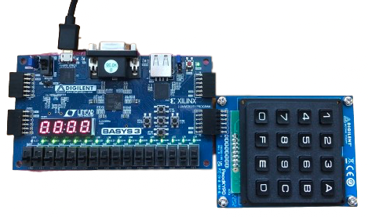
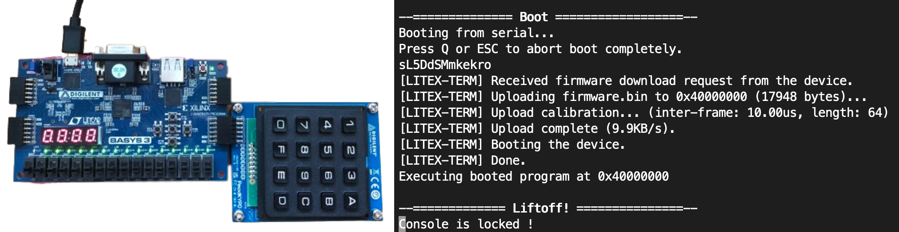

Challenge 1 : Unlock administration panel
=========================================

.. note:: 

    This challenge is automaticly enable, you can't desactivate it. To change the password used to access the administration panel (available on UART) you have to change the content of the field ``admin_dashboard_key``.
    The password should be a 4 digit key compound of any hexadecimal number.

Introduction
------------

This challenge is the first one, it was created to introduce players to the platform, with this challenge players will be able to familiarize themselves with the reading of the Verilog code and explore the different resources at their disposal. When the FPGA board starts, the serial link is activated but the console is not available, the goal is to unlock the console by finding the maintenance password which is in the Verilog code. Once this code is found, you just have to enter it on the keypad and the console will be unlocked giving access to the administration panel. This challenge is an introduction challenge and is rated as easy.

Setup of the challenge
----------------------

* The keypad is used to enter the password to unlock the administration panel.
* The 7 segment display is used to display the password currently entered.

Migen code of the challenge
---------------------------

The code of the challenge in LiteX is located in the file : ``Damn-Vuln-IoT-SoC/litex/litex/soc/cores/keypad/keypad.py``.

The password is checked digit by digit, it is easy to identify the check process in the Verilog code and retrieve the password. The password is set using the configuration file.

.. code-block:: python
    
    ...

    self.sync += [
            self.state.eq(self.key),
            If(self.key != self.state,
                If(self.counter == 0,
                    self.value.eq(0),
                    self.value[12:16].eq(self.key),
                    self.counter.eq(1)),
                If(self.counter == 1,
                    self.value[8:12].eq(self.key),
                    self.counter.eq(2)),
                If(self.counter == 2,
                    self.value[4:8].eq(self.key),
                    self.counter.eq(3)),
                If(self.counter == 3,
                    self.value[0:4].eq(self.key),
                    self.counter.eq(4)),
            ),
            If(self.counter == 4,
                self.status.status.eq(1),
                If(self.value[12:16] != int(self.current_key[0], 16), # Check of the first digit
                    self.status.status.eq(0),
                    self.value.eq(0)
                ),
                If(self.value[8:12] != int(self.current_key[1], 16), # Check of the second digit
                    self.status.status.eq(0),
                    self.value.eq(0)
                ),
                If(self.value[4:8] != int(self.current_key[2], 16), # Check of the third digit
                    self.status.status.eq(0),
                    self.value.eq(0)
                ),
                If(self.value[0:4] != int(self.current_key[3], 16), # Check of the fourth digit
                    self.status.status.eq(0),
                    self.value.eq(0)
                ),
                self.counter.eq(0)
            )
        ]

    ...

Verilog code of the challenge
-----------------------------

Every digits of the password is hardcoded in the verification process, it is easily to retrieve the combination and access to administration panel.

Here the password is ``0xF625``, since the ``admin_dashboard_key`` filed in config file ``config.ini`` is ``admin_dashboard_key = F625``.

.. code-block:: verilog
    
    ...
    
    main_keypad_state <= main_keypad_key;
	if ((main_keypad_key != main_keypad_state)) begin
		if ((main_keypad_counter == 1'd0)) begin
			main_keypad_value <= 1'd0;
			main_keypad_value[15:12] <= main_keypad_key;
			main_keypad_counter <= 1'd1;
		end
		if ((main_keypad_counter == 1'd1)) begin
			main_keypad_value[11:8] <= main_keypad_key;
			main_keypad_counter <= 2'd2;
		end
		if ((main_keypad_counter == 2'd2)) begin
			main_keypad_value[7:4] <= main_keypad_key;
			main_keypad_counter <= 2'd3;
		end
		if ((main_keypad_counter == 2'd3)) begin
			main_keypad_value[3:0] <= main_keypad_key;
			main_keypad_counter <= 3'd4;
		end
	end
	if ((main_keypad_counter == 3'd4)) begin
		main_keypad_status <= 1'd1;
		if ((main_keypad_value[15:12] != 4'd15)) begin // First digit 0xF
			main_keypad_status <= 1'd0;
			main_keypad_value <= 1'd0;
		end
		if ((main_keypad_value[11:8] != 3'd6)) begin // Second digit 0x6
			main_keypad_status <= 1'd0;
			main_keypad_value <= 1'd0;
		end
		if ((main_keypad_value[7:4] != 2'd2)) begin // Thrid digit 0x2
			main_keypad_status <= 1'd0;
			main_keypad_value <= 1'd0;
		end
		if ((main_keypad_value[3:0] != 3'd5)) begin // Fourth digit 0x5
			main_keypad_status <= 1'd0;
			main_keypad_value <= 1'd0;
		end
		main_keypad_counter <= 1'd0;
	end
    
    ...

Resolve the challenge
---------------------

At the start of the challenge, the console is locked, on series port this message is display :

Now we just have to enter the password that we previously retrieved (``0xF625``).

Then we can access the administration panel, and type the command ``help`` to show every commands available in the admin panel.

.. image:: images/unlock.png
  :width: 650
  :alt: Final phase of the challenge

Finaly you can continue on others challenges !