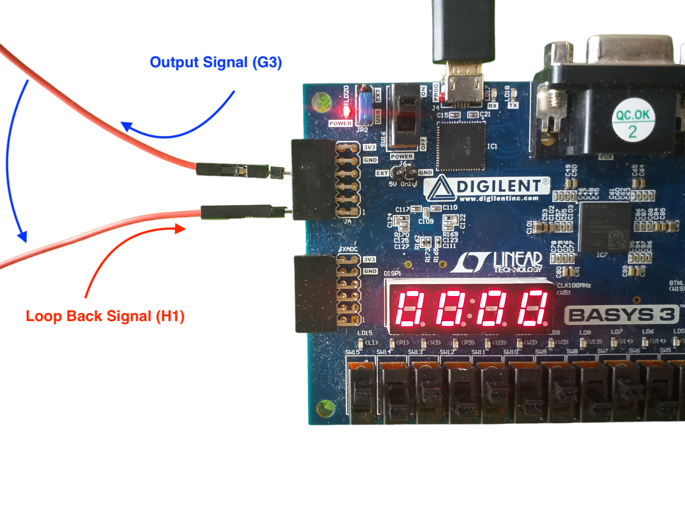
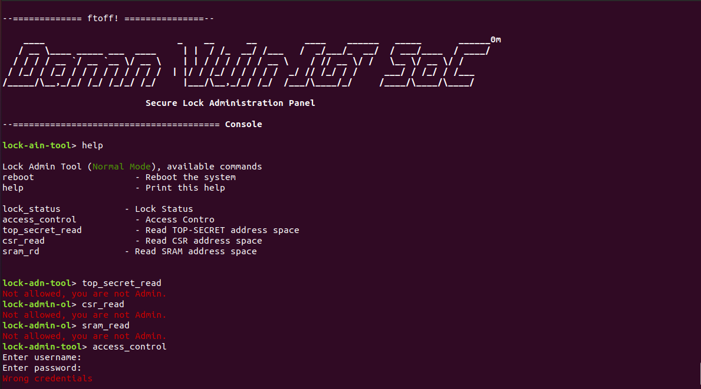
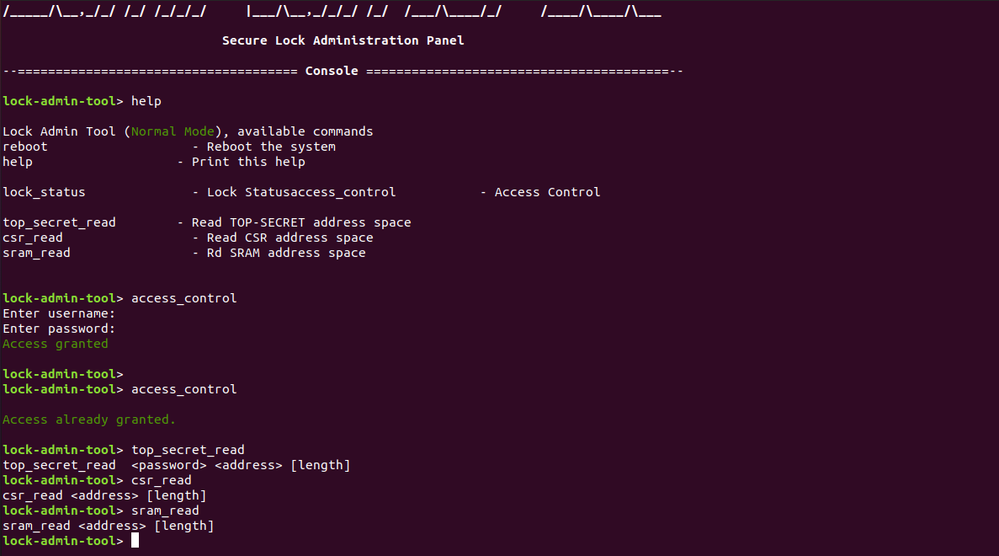
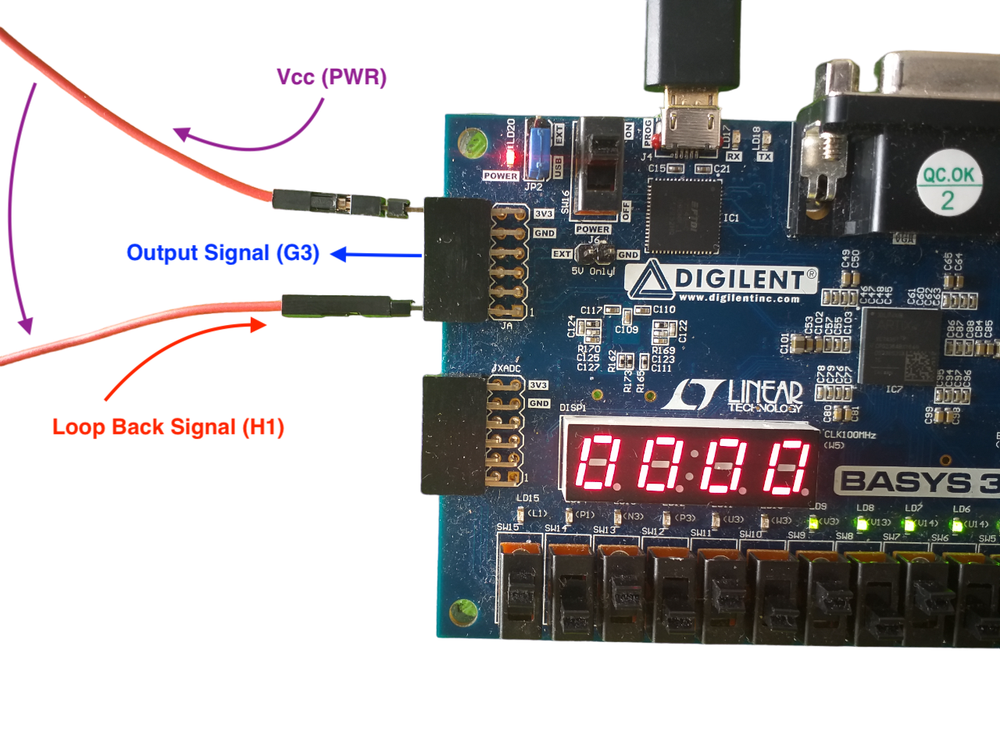
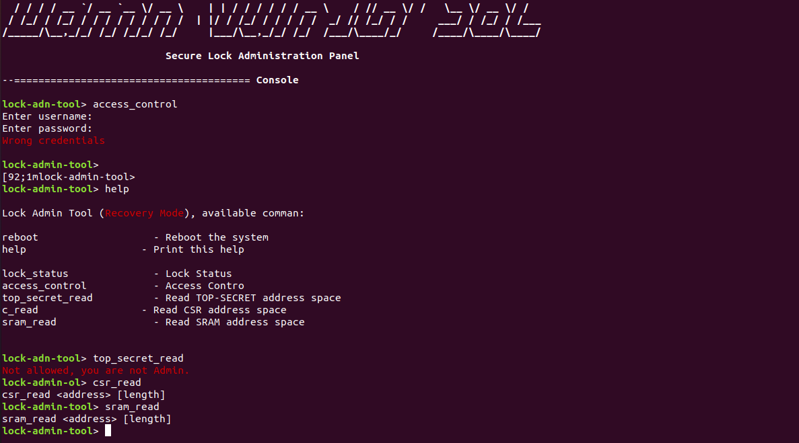

Challenge 6 : Loop Back Signal
==============================

.. note::
  To solve this challenge, you will need to gain access first to admin panel (challenge 1).

Introduction
------------

In this challenge, we'll explore a part of the system that's intended to handle physical mistakes. The system was designed with the ability to recover from these types of errors, and our objective is to attempt and figure out a way to find vulnerabilities in the system while it is handling errors.

Challenge Description
---------------------

The system is constructed so that it can manage physical errors that may arise in the event of a mistake. Since the strike will have an external power source, it could be, for instance: 

    - a thread cut 
    - a power supply issue 
    - etc.

Therefore, if this type of issue arises, the system will immediately go into recovery mode, and if we manage to reach the admin panel (through challenge 1), we may be able to use some (but not all) of the commands that are available (in recovery mode) even if we are not admin.

Approach
--------

We have a feedback loop to the lock to ensure that the lock's state exactly matches the command signal sent. This loop connects the lock's control signal (``Output Signal``) to another entry pin (``Loop Back Signal``).

..  _img:

Since the system will be in normal mode in this configuration, we must first join as an administrator in order to run some essential commands that need admin privileges. The normal mode is displayed in the following images both with and without admin credentials.

During hardware design, the GPIO pins are associeted to their respective CSR registers in order to allow the CPU to know their state or even change it.

When examining the generated VHDL code, it becomes apparent that a register called ERROR, which can also be seen in the following code, is the result of comparing the instruction signal and the bouncing signal. 

.. code-block:: verilog

  ...

  main_lock_handler_lock_error_storage <= (main_lock_handler_loop_back_signal_status != main_lock_handler_output_signal_storage);

  ...

Because of this, changing the value of this register would inevitably result in a system error. If this error were to occur, and was not properly handled, it might lead to security issues that could later be used to compromise the integrity of the system.

Solution
--------

Considering what we previously said, if we manage to break the connection between the two signals, we switche the system into recovery mode because, the state of the loose wire does not correspond to the order that was sent. In the picture below, the lock is in an unlocked state, that's mean the output signal is ``LOW``. So we connected the loop back signal to VCC (to change the state to ``HIGH``) in order to have a different logic state.

As a result, we will have access to commands that they are not authorized to execute in normal mode.

Conclusion
----------

In this challenge, we demonstrated how a feedback loop can be used to ensure the lock's state matches the command signal sent. By breaking the connection between the control signal and the entry pin, we were able to bypass the feedback loop and gain access to unauthorized commands. This challenge highlights the importance of understanding how feedback loops work and the potential security risks associated with using them.

Lessons Learned
---------------

In solving this challenge, we learned the importance of analyzing the lock's code to understand how feedback loops are implemented. We also learned the importance of monitoring signals to identify connections between different pins and testing different methods to break the connection.