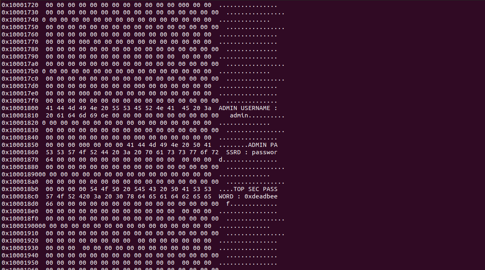
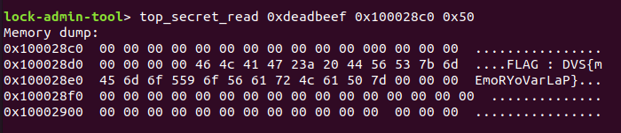

Challenge 7 : Memory Overlap 
============================

.. note::
    What was done in task 6 continues in this challenge. In other words, you will require memory commands, which are only accessible with admin privileges.

Introduction
------------

In this challenge, we were presented with a memory overlap problem that required us to extract a flag and admin credentials from a memory dump.

Challenge Description
---------------------

We have a memory overlap between two memory regions. When two distinct bits of data are kept in the same memory location, a memory address overlap happens. This can result in data loss or corruption and present a significant security risk (that is our case). The RAM and a secrete area are the two memory regions where the addresses overlap. Finding the flag that is stocked off-course, in the hidden area, and precisely in the portion of the region that is outside the overlap area is the objective. 

The admin information and password required to view the content of the secrete region are also stored in the secrete region. However, this time, the admin credentials and the password for the secret region are kept in the overlap area.

Approach
--------

Is comming...

Solution
--------

If we are able to determine that there is an address crossover between these two regions based on the hardware design. Taking into account the fact that we have the ability to read the contents of the SRAM memory, we may attempt to read all of the content to see if any interesting information can be gleaned from it. And if that happens, it will become apparent that it is possible to access a portion of the secret region and find the admin's username, password, and password to read the region's content. 

Once one has these connection details in the role of administrator, they can connect using the command "access_control" to identify themselves, be able to read the entire contents of the secret region, and in that case, be able to access the flag.

Conclusion
----------

In this challenge, we demonstrated how memory overlap can present a security risk and result in data loss or corruption. By carefully analyzing the memory dump and identifying the overlapping region, we were able to extract the flag and the admin credentials from the memory dump and use the credentials to access the secret region and retrieve the flag. This challenge highlights the importance of careful memory management and the potential risks associated with memory overlap.

Lessons Learned
---------------

In solving this challenge, we learned the importance of analyzing memory dumps and carefully searching for specific patterns or strings that are associated with the flag and the admin credentials. We also learned the importance of careful memory management to avoid memory overlap and potential security risks.